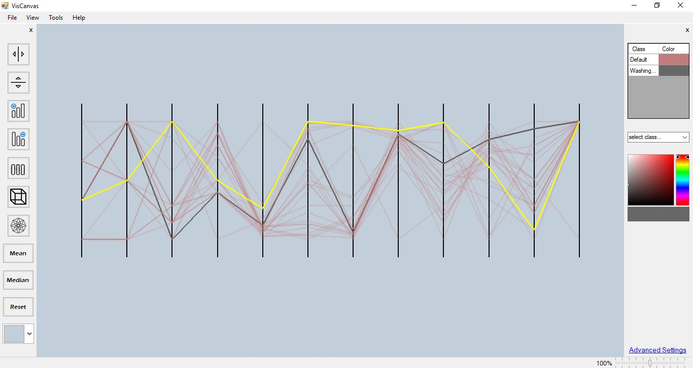

 # VisCanvas

High-dimensional data visualization tool using General Line Coordinates (GLC). GLC is a parallel coordinate representation of data.

This tool allows a user to sort each set of data and change the color of associated classifications. Not to mention, a user has the
ability to change the view to hypercube clusters. They can also sort the data in `asc.` or `desc.` order. Also, there's the option
to do so manually, via click-and-drag.

This was a capstone project at Central Washington University. There are hopes of many new features and enhancements to come in the
near future, as this project becomes more mature — stay tuned!

